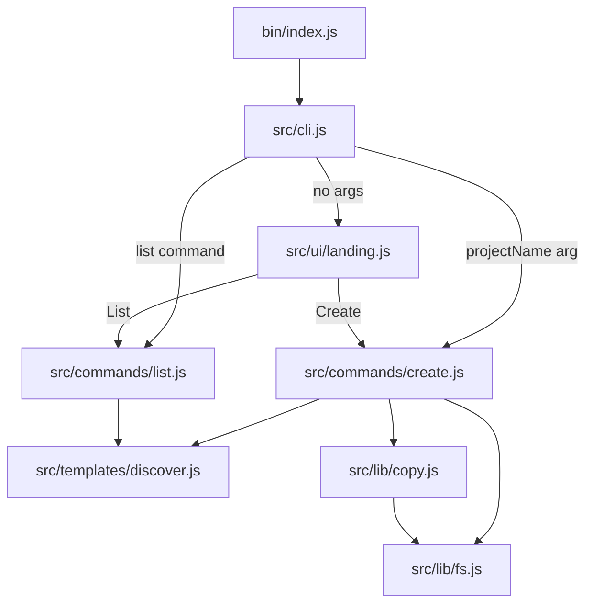

# 📚 Codebase Guide (Non-Template Code)

This document explains how the **CLI generator** works (the JavaScript code in `bin/` + `src/`).

It intentionally **does not document the contents of `templates/`** (the generated starter projects), because those are “output assets” rather than the CLI implementation.

---

## 🧠 Mental Model

- `bin/index.js` is the published executable entrypoint.
- `src/cli.js` defines the CLI commands/options using `commander`.
- `src/ui/landing.js` is the interactive “landing page” (ASCII banner + menu) using `@clack/prompts`.
- `src/commands/*` contains the real actions: `create` and `list`.
- `src/templates/discover.js` dynamically discovers templates from the `templates/` folder.
- `src/lib/*` contains small reusable filesystem utilities and copy logic.

---

## 🔁 Execution Flow

### 1) Entrypoint

`create-drogon-app` (the npm binary) runs:

- `bin/index.js` → calls `run(process.argv)` from `src/cli.js`

### 2) Top-level CLI behavior

`src/cli.js` defines:

- Default invocation: `create-drogon-app [projectName]`
  - If `projectName` **is provided**, it runs project creation immediately.
  - If `projectName` **is not provided**, it opens the interactive landing UI.
- Subcommands:
  - `create-drogon-app create [projectName]`
  - `create-drogon-app list`

### 3) Landing UI

`src/ui/landing.js` prints an ASCII banner and offers a menu:

- Create a new project
- List templates
- Exit

Internally:

- “Create” calls `createProject({})`
- “List” calls `listTemplates()` and prints the results

### 4) Creating a project

`src/commands/create.js` handles both interactive and non-interactive creation:

- Discovers templates (`discoverTemplates()`)
- Resolves the chosen template (`getTemplateById()`)
- Determines target directory
- Handles overwrite logic (`--force`, interactive confirm, or `--yes` behavior)
- Copies files from the template directory into the target (`copyDir()`)

### 5) Listing templates

`src/commands/list.js` is intentionally tiny:

- Returns `discoverTemplates()`

---

## 🗺️ Architecture Diagram



---

## 🧩 Module-by-Module

### `bin/index.js`

Purpose:

- Extremely small shim so the published binary stays stable.

Behavior:

- `require("../src/cli").run(process.argv)`

Why it matters:

- Lets you refactor everything under `src/` without changing the npm binary.

---

### `src/cli.js`

Purpose:

- Defines the CLI surface area: commands, options, help text.

Key dependencies:

- `commander` for command parsing
- `picocolors` for colored output

Important behavior:

- If the user runs `create-drogon-app` with **no project name**, it calls `runLanding()`.
- Otherwise it calls `createProject({ projectName, template, force, yes })`.

Extending tips:

- Add new subcommands here (e.g. `doctor`, `info`, `init`).
- Keep this file “routing-focused” and push real logic into `src/commands/`.

---

### `src/ui/landing.js`

Purpose:

- Provides the “landing page” style experience.

Key dependency:

- `@clack/prompts` for TUI prompts

Design choices:

- The UI is intentionally minimal: 3 actions and no extra screens.
- It delegates actual work to the command layer (`src/commands/*`).

Extending tips:

- If you add new capabilities, add a new menu option that calls the appropriate command.

---

### `src/commands/create.js`

Purpose:

- Implements project generation.

Key steps:

1. Discover templates with `discoverTemplates()`
2. Decide a template ID:
   - from `--template`, else first discovered template
3. If `projectName` is missing:
   - interactive prompts (template picker + project name)
   - or default if `--yes`
4. Resolve the template via `getTemplateById()`
5. Resolve target path: `path.resolve(process.cwd(), projectName)`
6. Handle existing target folder:
   - `--yes` + no `--force` → error
   - interactive mode → confirm overwrite
   - `--force` → delete folder
7. Copy template contents into the target folder

Notes on prompting:

- `isCancel()` is used to gracefully abort.

Extending tips:

- If you want per-template prompts (e.g. “Enable S3?”), this is the place to do it.
- Keep the output stable and easy to copy/paste.

---

### `src/commands/list.js`

Purpose:

- Exposes template discovery as a command.

Why it matters:

- It’s a simple “contract test” for discovery: if `list` works, the template root is readable.

---

### `src/templates/discover.js`

Purpose:

- Dynamically discovers which templates exist.

How discovery works:

- Template root is computed from the package root: `<packageRoot>/templates`
- Every **directory** inside `templates/` becomes a “template” entry
- Hidden directories (starting with `.`) are ignored

Optional metadata:

- A template directory may include a `template.json` file.
- Supported fields:

```json
{
  "name": "Human readable name (optional)",
  "description": "Shown in the UI (optional)",
  "exclude": ["build", ".git", "node_modules"]
}
```

Excludes:

- `getTemplateById()` merges default excludes with per-template excludes.
- Defaults currently include: `.git`, `node_modules`, `build`, `dist`, `.cache`.

Why excludes exist:

- Prevents copying large or irrelevant folders into generated projects (especially `build/`).

---

### `src/lib/fs.js`

Purpose:

- Small filesystem helpers.

Key utilities:

- `pathExists(p)`: boolean check
- `ensureDir(p)`: recursive mkdir
- `ensureEmptyDir(p)`: ensures the directory exists (does not wipe it)
- `removeDir(p)`: recursive delete
- `readJsonIfExists(p)`: reads JSON or returns `null`
- `isExcluded(relPath, excludeList)`: checks whether a path should be excluded

Important note:

- `ensureEmptyDir()` currently *does not* remove existing contents. The overwrite behavior is handled earlier by `removeDir()` when `--force` is used.

---

### `src/lib/copy.js`

Purpose:

- Copies template files into the target directory.

Behavior:

- Walks the source directory recursively.
- Applies `exclude` rules against the *full relative path from the template root*.
- Supports copying:
  - regular files
  - directories
  - symlinks

Why this exists:

- Node’s `fs.cp` is convenient, but this custom copier makes it easy to apply consistent exclude rules.

---

## 🧪 Local Development (CLI only)

Run commands locally from the repo root:

```bash
node ./bin/index.js list
node ./bin/index.js my-test-app --yes
node ./bin/index.js create my-test-app --template drogon-starter --force
```

---

## 🚀 Publishing Notes (npm)

npm does not allow publishing the same version twice.

Typical flow:

1. Bump version in `package.json` (and commit).
2. Verify package contents:

```bash
npm pack --dry-run
```

3. Publish:

```bash
npm publish
```

---

## 🔧 Where to Extend Safely

- New user-visible commands: `src/cli.js` + new file under `src/commands/`
- New interactive screens: `src/ui/landing.js`
- Template discovery rules: `src/templates/discover.js`
- Copy/exclude behavior: `src/lib/copy.js` and `src/lib/fs.js`
